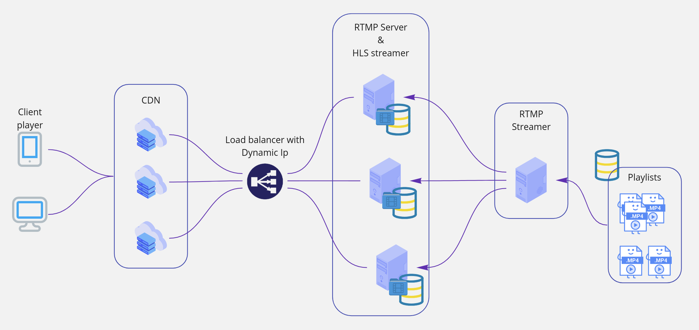

# Linear Live Stream Simulator

## Features

- Simulating live RTMP stream
- Streaming playlist of files located in "Playlists" folder 
- Generating a live linear stream
- Uniform client-side playback for  videos file with different may resolution, aspect ratio, frame rate, etc.
- Continuous playback
- HLS playback support on a wide range of devices and platforms with varying bandwidths
- Scalable Resolution

## Getting Started
### 1. Clone project repository
 ```shell
git clone https://github.com/frznpr/liveLinearStreamer.git
cd liveLinearStreamer
sudo chmod -R 777 src/storage/hls/
 ```   

### 2. Run docker container
```shell
docker-compose up
 ```   

### 3. Creating playlist
   To simplify creating and managing playlists you can create a folder inside playlists folder. 

   This folder acts as a playlist and folder name equals to playlist name.

   Streamer will play playable videos inside each folder in alphabetical order.

   Playlist folder structure:
```
Playlists |----> playlist1 |----> video1
          |                |----> video2
          |                |----> video[n]
          |
          |----> playlist2 .....
          | .....
          |----> playlist[n] .....
```
One sample playlist already exists in "Playlists" folder. 

### 4 . Starting a playlist stream:
   It runs python code written in Sanic framework which makes a linear RTMP stream using FFMPEG scaling and transcoding pipeline and send it to RTMP server 
   hosted on nginx at ```port: 1935```.
   
```shell
curl http://localhost:8081/stream/playlist1 #[Playlist_name/Folder_name]
```

### 5. HLS live link contains the name of the playlist/folder_name as hls manifest name. 
After waiting for 30 second you can view streaming playlist in vlc:

```shell
vlc http://127.0.0.1:8080/hls/playlist1.m3u8 #[Playlist_name/Folder_name]
```

### 6. Streaming multiply playlists at the same time  
To make rtmp streaming scalable you can run several streams at the same time:
```shell
curl http://localhost:8081/stream/playlist2 #[Playlist_name/Folder_name]
curl http://localhost:8081/stream/playlist3 #[Playlist_name/Folder_name]
#....
```

### 7. Configs
- Rtmp_streamer sanic config files located in ```src/config``` folder.
- Hls_streamer nginx config file located in ```Docker/hls-streamer/config.nginx``` folder.

## Solution Architecture
As the following diagram shows, the solution has four main services:
- RTMP streamer
- RTMP servers and HLS streamers
- Load balancer
- CDNs



### RTMP streamer
Rtmp streamer is responsible to get playlists of videos, make a linear stream and send it to rtmp server.
It is written in python Sanic framework which makes a linear RTMP stream by scaling, panning and transcoding playlist videos using ffmpeg library.

To be highly available and scalable this service streams data to all available RTMP_servers.

### RTMP servers and HLS streamers
RTMP server and HLS streamer is based on nginx_rtmp_module. Using this module enables nginx to receive rtmp stream, make ts chunks and m3u8 playlist manifests from incoming stream for each playlist.
It also has config parameters to define ts chunk duration and number of chunks on each m3u8 playlist.

Due to scalability and highly availability reasons, all of this servers receives the same rtmp stream. So in case of server failure other servers can cover real-time requests.

### Load balancer
Load balancer has heart beat and service health check functionality. It redirects user requests to a healthy server which has less load.
Having dynamic IP addresses helps with system redundancy. 

### CDNs
As the edge point of streaming service, CDNs are responsible to get user requests and return respective content parts.

In this solution, we have 3 different content types:

- ***Master hls m3u8 manifest for each streaming playlist*** which is generated when streaming is started and stay static. 
  While streaming, they can be cached by CDNs.    
  
- ***Different resolution hls manifest for each playlist***. Each resolution specified in m3u8 file contains 5 ts files with 5 second 
  duration, 25 second in total. Every 5 second hls streamer pushes new ts chunk in to the playlist and removes the first one (fifo).
  Like that CDNs can cache each manifest for 5 seconds with playlist_name as hash key.
  
- ***New Ts video chunk*** is generated every 5 seconds, it contains the last 5 second of the video stream. According to hls manifest 
  list size (5 for this project) each segment should be cached at least for 30 seconds with combination of playlist_name, quality and segment_id as caching hash key. 
  


# Ubuntu Stand Alone Installation

## Install Hls_streamer

```shell
sudo apt-get install libpcre3 libpcre3-dev libavcodec-dev libavfilter-dev libswscale-dev libxml2-dev
```

### Build nginx_rtmp_module as a dynamic module
```shell
mkdir nginx nginx_rtmp_module
curl -sL https://nginx.org/download/nginx-1.18.0.tar.gz | tar -C ./nginx --strip 1 -xz
curl -sL https://github.com/arut/nginx-rtmp-module/archive/refs/tags/v1.2.2.tar.gz | tar -C ./nginx-rtmp-module --strip 1 -xz

cd nginx
./configure \
--user=nginx --group=nginx --with-compat --with-file-aio --with-threads --with-http_addition_module --with-http_auth_request_module --with-http_dav_module --with-http_flv_module --with-http_gunzip_module --with-http_gzip_static_module --with-http_mp4_module --with-http_random_index_module --with-http_realip_module --with-http_secure_link_module --with-http_slice_module --with-http_ssl_module --with-http_stub_status_module --with-http_sub_module --with-http_v2_module --with-mail --with-mail_ssl_module --with-stream --with-stream_realip_module --with-stream_ssl_module --with-stream_ssl_preread_module \
--add-dynamic-module=../nginx-rtmp-module --prefix=./build
```

## Compile    
```shell
make
make install
```

Dynamic module build will located in ```build/modules/ngx_http_vod_module.so```.

### Change service config values
Set configuration values located in ```Docker/hls-streamer/config.nginx``` folder.

##Install Rtmp_streamer
### Install python and python3
```shell
sudo apt-get install python ffmpeg
sudo apt-get install python3 supervisor gunicorn
```

### Install pip3
```shell
sudo apt-get install python3-pip
```

### Install sanic
```shell
sudo python3 -m pip install sanic
```

### Install virtualenv
```shell
sudo pip3 install virtualenv
```

### Set virtualenv path and active it 
```shell
# go to project src path
cd liveLinearStreamer/src
virtualenv virtualenvs/liveLinearStreamer
source virtualenvs/liveLinearStreamer/bin/activate
```

### Install needed libraries
```shell
pip3 install -r python_requirements.txt
```

### Set conf values
Set configuration values located in ```src/config``` folder.

### Run service
```shell
gunicorn public.server:liveLinearStreamer --worker-class sanic.worker.GunicornWorker -t 0
```